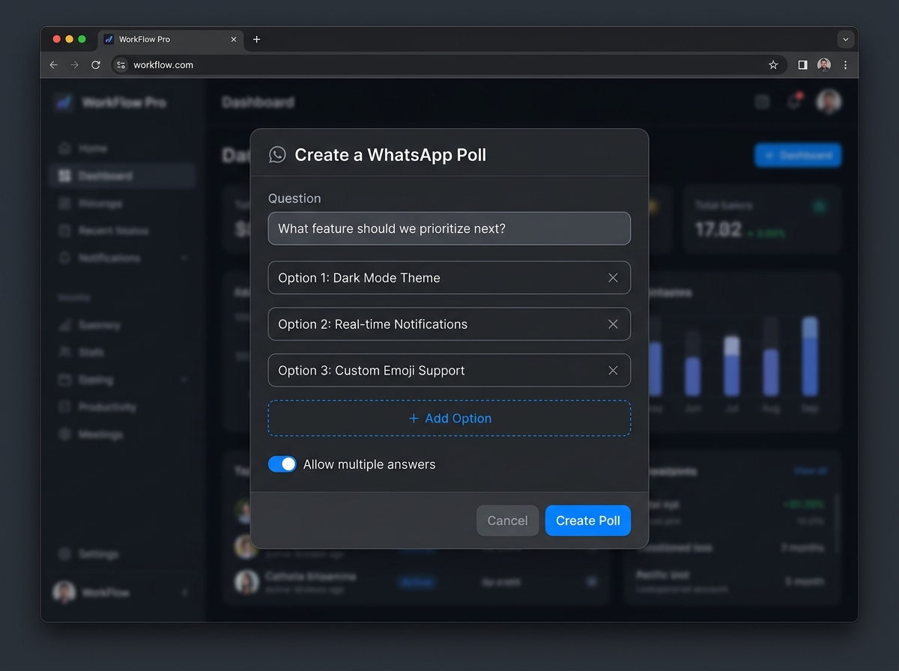
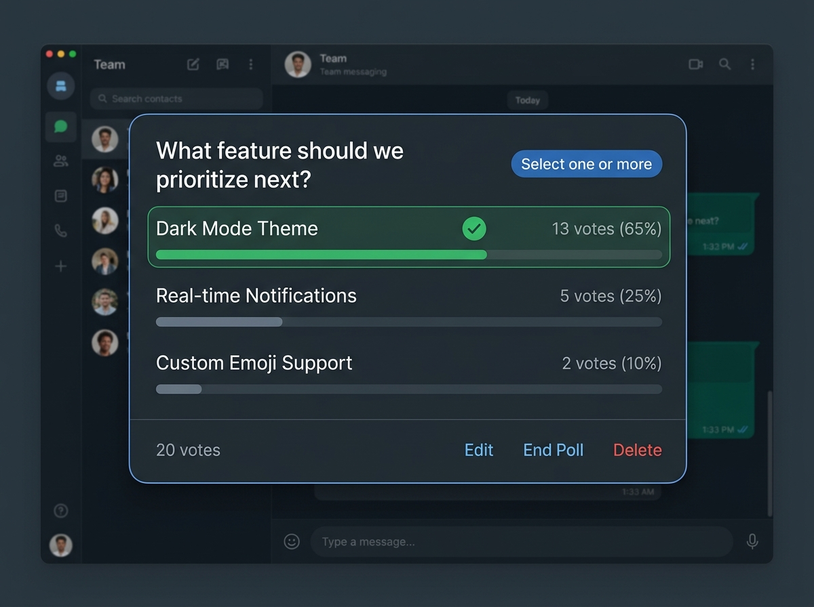

# 📊 Mattermost WhatsApp Style Polls Plugin

[](https://mattermost.com)
[](https://github.com/sahanRanasingha/mattermost-plugin-whatsapp-polls)
[](https://sahanranasingha.me)
[](LICENSE)

An interactive, modern **WhatsApp-style Polls Plugin** for Mattermost. Create clean, responsive polls with live progress bars, multiple-choice options, and creator-only moderation permissions directly within your team channels.

---

## ✨ Features

- 📱 **WhatsApp-Inspired Aesthetics**: Sleek dark/light theme integration with progress bars, vote percentages, and visual selection checkmarks.
- 🛠️ **Interactive Modal Builder**: Type `/poll` to open a full modal builder allowing dynamic addition/removal of options (up to 10) and single vs. multiple selection toggles.
- ⚡ **Instant Slash Command Support**: Quickly launch polls via `/poll "Question?" "Option 1" "Option 2"`.
- 🔐 **Creator & Admin Moderation Controls**:
  - **Edit Poll**: Creator can modify questions or add/remove options on active polls.
  - **End Poll**: Stop accepting new votes once a decision is made.
  - **Delete Poll**: Safely purge active or ended polls with confirmation dialogs.
- 🎯 **Single & Multiple Choice**: Flexible voting rules per poll (*"Select one"* vs. *"Select one or more"*).
- 🛡️ **Enterprise Security**: Full CSRF protection, Mattermost session authentication, and isolated KVStore state.

---

## 📸 Screenshots

| Poll Modal Builder | Custom WhatsApp Poll Card |
| :---: | :---: |
|  |  |
| *Modal interface with custom question & dynamic options* | *Interactive poll with live vote counts & percentage bars* |

---

## 🚀 Quick Start & Installation

### Option 1: Manual Upload (Release Bundle)

1. Download the latest release tarball `me.sahanranasingha.poll.tar.gz` from the [Releases](https://github.com/sahanRanasingha/mattermost-plugin-whatsapp-polls/releases) page.
2. Log in to your Mattermost workspace as a **System Admin**.
3. Go to **System Console** ➔ **Plugins** ➔ **Plugin Management**.
4. Under **Upload Plugin**, choose the `.tar.gz` file and click **Upload**.
5. Locate **WhatsApp Style Polls** in the installed plugins list and click **Enable**.

---

## 📖 How to Use

### 1. Slash Command & Interactive Builder
Simply type:
```text
/poll
```
This launches the custom **Create Poll Modal**:
1. Enter your **Question**.
2. Add your **Options** (minimum 2, maximum 10).
3. Toggle **"Allow multiple answers"** if desired.
4. Click **Create Poll**.

### 2. Direct Command Syntax
You can also launch polls directly without opening the modal:
```text
/poll "What should we have for lunch?" "Pizza 🍕" "Burgers 🍔" "Tacos 🌮"
```

---

## 🛠️ Building from Source

### Prerequisites
- [Go](https://golang.org/doc/install) 1.22 or higher
- [Node.js](https://nodejs.org/) v18+ and `npm`
- `make` utility

### Build Steps

1. **Clone the repository:**
   ```bash
   git clone https://github.com/sahanRanasingha/mattermost-plugin-whatsapp-polls.git
   cd mattermost-plugin-whatsapp-polls
   ```

2. **Build Webapp Bundle:**
   ```bash
   cd webapp
   npm install
   npm run build
   cd ..
   ```

3. **Build Server Executable & Create Release Package:**
   ```bash
   make bundle
   ```
   The compiled plugin package will be generated at `dist/me.sahanranasingha.poll.tar.gz`.

---

## ⚙️ Plugin Configuration & Architecture

| Setting | Details |
| :--- | :--- |
| **Plugin ID** | `me.sahanranasingha.poll` |
| **Min Mattermost Version** | `7.0.0+` |
| **Server Executable** | Go (Linux `amd64` & `arm64`) |
| **Webapp Frontend** | React 18 / TypeScript / Custom Modals & Portals |
| **Storage Backend** | Mattermost KVStore (`poll_{poll_id}`) |

---

## 🤝 Contributing

Contributions, feature suggestions, and pull requests are very welcome!

1. Fork the repository
2. Create your feature branch (`git checkout -b feature/amazing-feature`)
3. Commit your changes (`git commit -m 'Add amazing feature'`)
4. Push to the branch (`git push origin feature/amazing-feature`)
5. Open a Pull Request

---

## 👨‍💻 Author & Maintainer

Designed and developed by **Sahan Ranasingha**.

- 🌐 **Website**: [sahanranasingha.me](https://sahanranasingha.me)
- 🐙 **GitHub**: [@sahanRanasingha](https://github.com/sahanRanasingha)

---

## 📜 License

This project is licensed under the [MIT License](LICENSE).
